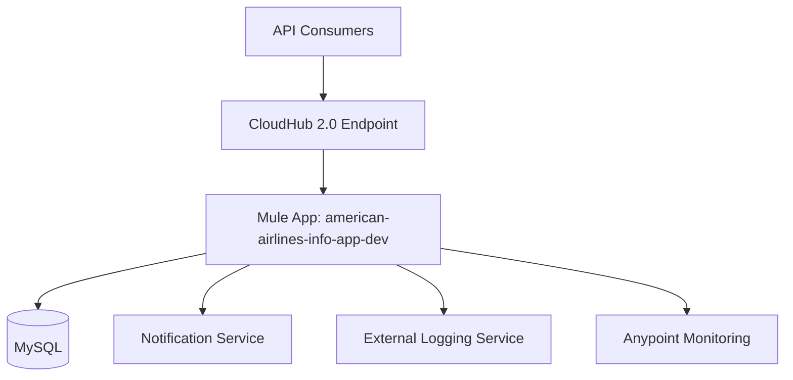
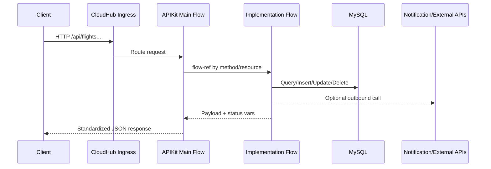
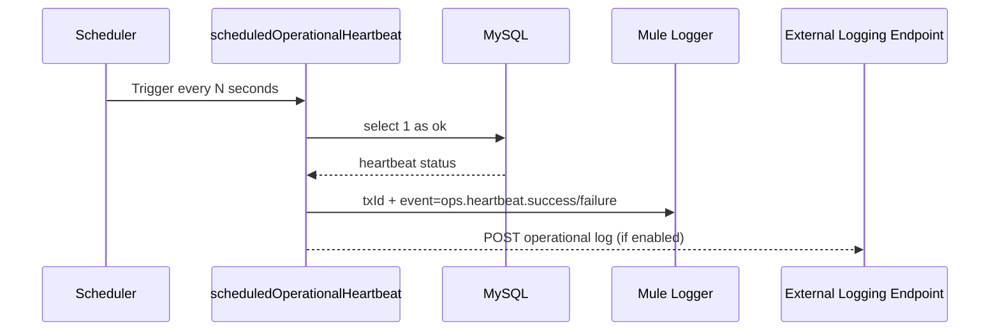
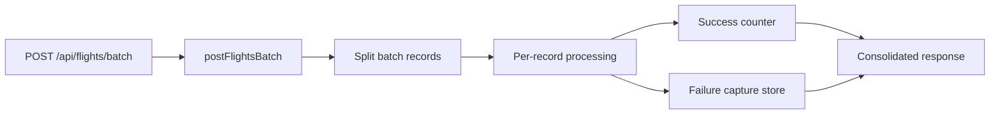
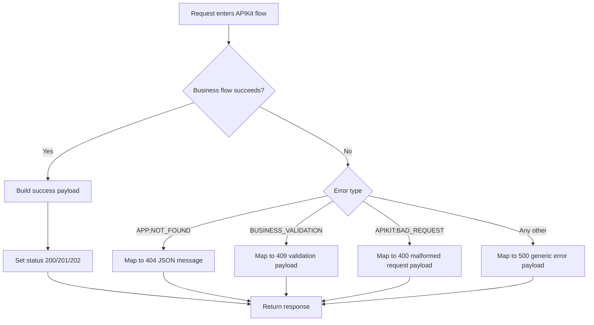
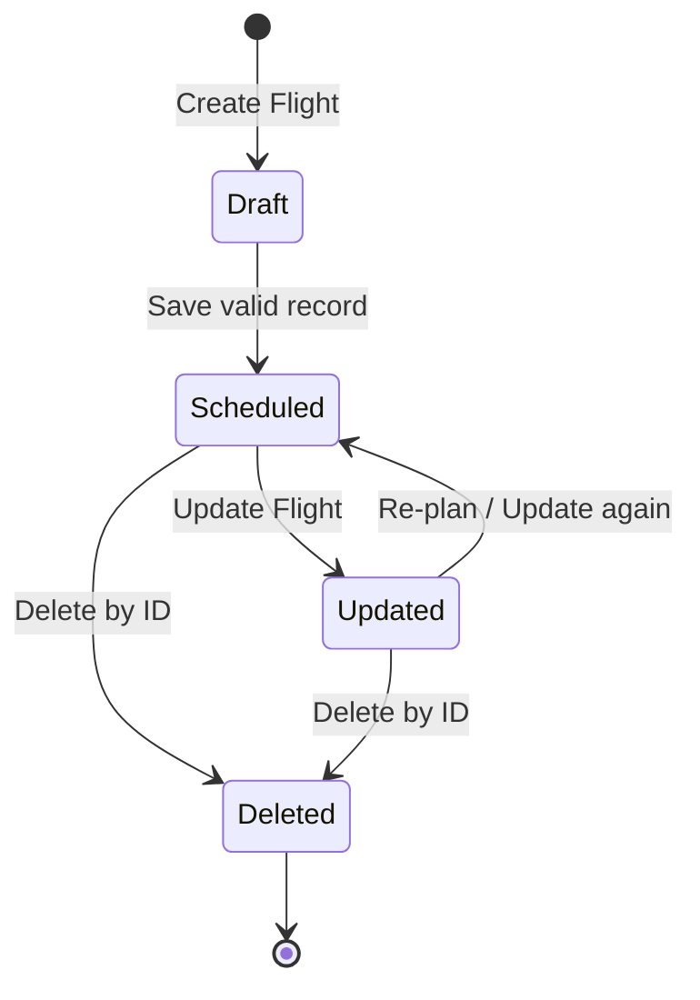

# American Airlines Info API - HLD and LLD

## 1) High-Level Design (HLD)

### 1.1 Context
`american-airlines-info-app` is a MuleSoft API-led implementation exposing airline flight operations and DataWeave transformation demos over HTTP on CloudHub 2.0.

### 1.2 Logical Components

- **Experience/API Layer**
  - APIKit router flow: `american-airlines-info-api-main` in `interface.xml`
  - Error mapping and HTTP response shaping
- **Business/Implementation Layer**
  - `getAllFlights`, `getFlightById`, `postFlights`, `updateFlightById`, `deleteFlightById`, `postFlightsBatch`
  - Circuit breaker orchestration and resilience logic
- **Integration Layer**
  - MySQL database connector
  - Outbound HTTP requests for notifications and external logging
- **Operational Layer**
  - `scheduledOperationalHeartbeat` scheduler flow in `ops.xml`
  - Correlated logging and transaction tracing
- **Transformation Layer**
  - DataWeave scripts in `src/main/resources/dwl/usecases`
  - Demo listener flows in `dw-demo-flows.xml`

### 1.3 Deployment Topology



### 1.4 End-to-End Request Sequence (CRUD)



### 1.5 Scheduler and Operational Flow Sequence



### 1.6 Batch Processing Design View



### 1.7 Non-Functional Characteristics

- Runtime: Mule 4.6.28, Java 17
- Environment-based configuration (`mule.env=dev`)
- Secure properties encryption using `mule.key`
- Structured logging with transaction identifiers

## 2) Low-Level Design (LLD)

### 2.1 Interface Flows

- `american-airlines-info-api-main`
  - Listener: `/api/*`
  - Sets `transactionId` from `correlationId`
  - Routes to APIKit and mapped implementation flows
- `american-airlines-info-api-console`
  - Listener: `/console/*`
  - API console rendering and not-found handling

### 2.2 Core Business Flows

- `getAllFlights`: list flights, optional query filtering path handled by implementation logic
- `getFlightById`: retrieve one flight by ID
- `postFlights`: create flight and send async downstream notification
- `updateFlightById`: update existing flight and invoke outbound notification
- `deleteFlightById`: delete existing flight; returns controlled not-found response
- `postFlightsBatch`: batch payload processing with consolidated result handling

### 2.3 DataWeave Demo Flows

- `/dw/simple` -> `simple-transformation-json-to-json.dwl`
- `/dw/complex` -> `complex-transformation-xml-to-json.dwl`
- `/dw/multi1` -> `multi-scenario-1-json-to-xml.dwl`
- `/dw/multi2` -> `multi-scenario-2-xml-to-json.dwl`

### 2.4 Scheduler Flow

- Flow: `scheduledOperationalHeartbeat`
- Trigger: fixed frequency (`ops.heartbeat.frequencySeconds`)
- Steps:
  1. Generate `transactionId`
  2. DB health query (`select 1 as ok`)
  3. Log heartbeat success/failure
  4. Optional external logging POST when enabled

### 2.5 Configuration Model

- Normal properties: `config-${mule.env}.properties`
- Secure properties: `config-${mule.env}-secure.properties`
- Secure values include DB secrets, runtime keys, and platform client credentials.

### 2.6 Error Handling and Observability

- APIKit + custom error handler paths for HTTP status consistency
- `logger` components include tx/correlation context
- Rolling + JSON console logging in `log4j2.xml`

### 2.7 Error Handling Flow Diagram



### 2.8 Flight Management Lifecycle Diagram



### 2.9 API-to-Implementation Mapping Diagram

```mermaid
flowchart LR
    A1[GET /api/flights] --> F1[getAllFlights]
    A2[GET /api/flights/{ID}] --> F2[getFlightById]
    A3[POST /api/flights] --> F3[postFlights]
    A4[PUT /api/flights/{ID}] --> F4[updateFlightById]
    A5[DELETE /api/flights/{ID}] --> F5[deleteFlightById]
    A6[POST /api/flights/batch] --> F6[postFlightsBatch]
```
