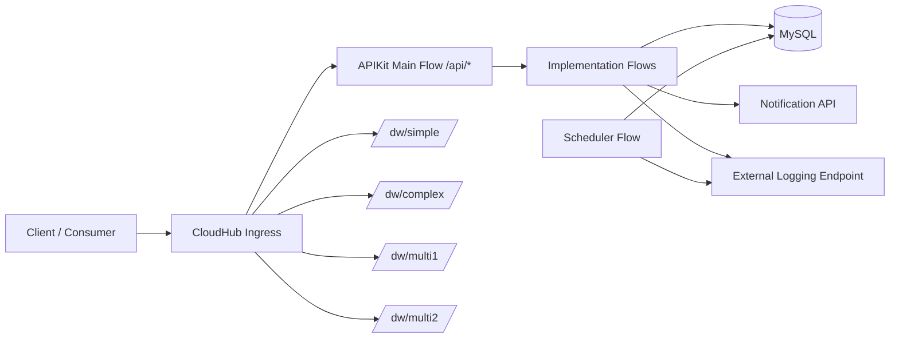
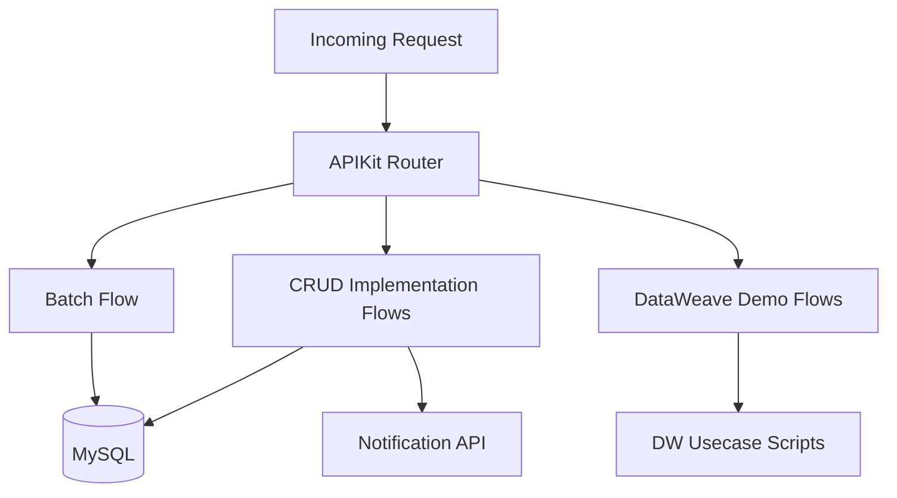
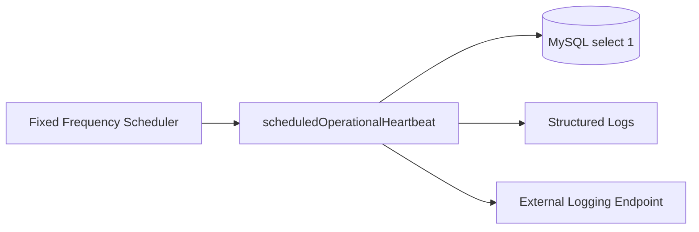
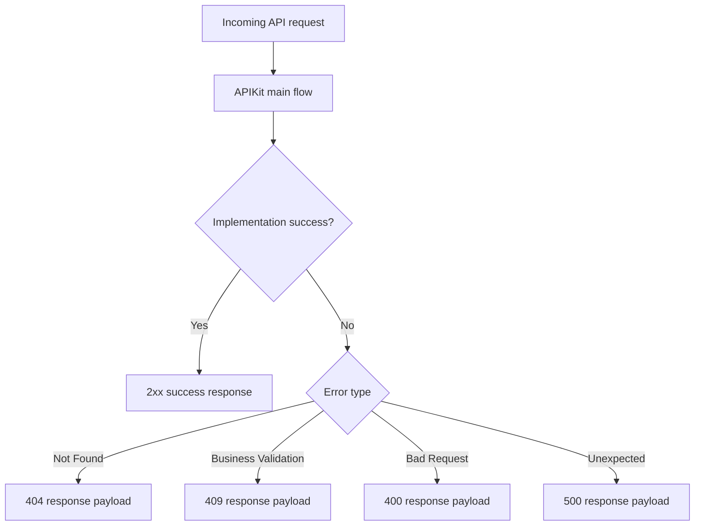
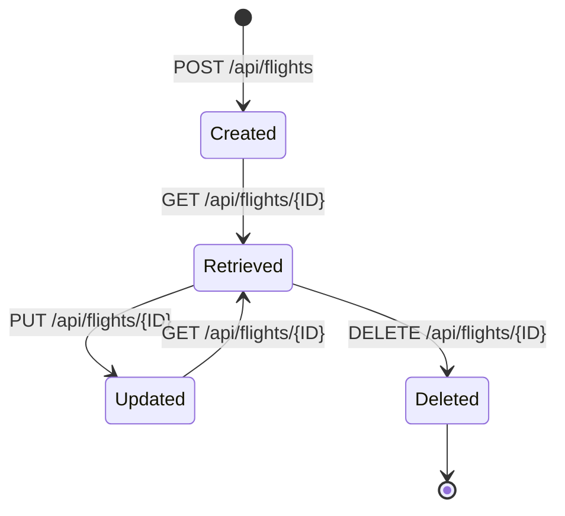

# American Airlines Info API

This asset documents the implementation and operational model for `american-airlines-info-app`.

## Documentation Status

- This `home.md` content is the Exchange home-page source for asset:
  - `ad084e57-f62a-4ad8-876a-fa4bf9f3f7ce / american-airlines-info-api / 1.0.1`
- Publication workflow used:
  1. Update draft page `home`
  2. Publish asset documentation state
- Supporting docs are available in repository under `docs/` and Word package `docs/MASTER_DOCUMENTATION.docx`.

## Functional Scope

- Flight CRUD services (`GET`, `POST`, `PUT`, `DELETE`) exposed through APIKit under `/api/*`.
- Batch flight ingestion for multi-record processing with error capture.
- DataWeave demo services under:
  - `POST /dw/simple`
  - `POST /dw/complex`
  - `POST /dw/multi1`
  - `POST /dw/multi2`

## Operations and Reliability

- Scheduler-based operational heartbeat (`scheduledOperationalHeartbeat`) that validates DB connectivity every configured interval.
- Circuit-breaker support using ObjectStore-backed state.
- External logging connector path for downstream observability.
- Transaction-aware logging with `transactionId` and `correlationId` propagation.

## Deployment

- Runtime: Mule 4.6.28 on CloudHub 2.0 (Java 17).
- Environment model:
  - Non-sensitive: `config-${mule.env}.properties`
  - Sensitive: `config-${mule.env}-secure.properties`

## Architecture Diagram

## Workflow Diagram (Service-Level)

## Operational Scheduler Diagram

## Postman Playground

- Import-ready collection for all services:
  - `postman/american-airlines-info-api-playground.postman_collection.json`
- Import-ready environments:
  - `postman/american-airlines-info-api-cloudhub.postman_environment.json`
  - `postman/american-airlines-info-api-local.postman_environment.json`
- Includes clear request naming, purpose descriptions, and cURL references for:
  - All `/api/flights` business services
  - Batch endpoint
  - All DataWeave demo endpoints

## Error Handling Diagram

## Flight Management Lifecycle

