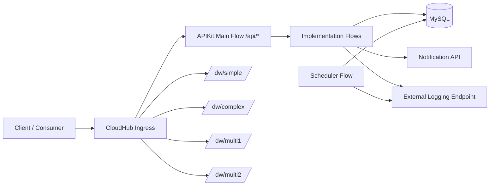

# American Airlines Info API

This asset documents the implementation and operational model for `american-airlines-info-app`.

## Functional Scope

- Flight CRUD services (`GET`, `POST`, `PUT`, `DELETE`) exposed through APIKit under `/api/*`.
- Batch flight ingestion for multi-record processing with error capture.
- DataWeave demo services under:
  - `POST /dw/simple`
  - `POST /dw/complex`
  - `POST /dw/multi1`
  - `POST /dw/multi2`

## Operations and Reliability

- Scheduler-based operational heartbeat (`scheduledOperationalHeartbeat`) that validates DB connectivity every configured interval.
- Circuit-breaker support using ObjectStore-backed state.
- External logging connector path for downstream observability.
- Transaction-aware logging with `transactionId` and `correlationId` propagation.

## Deployment

- Runtime: Mule 4.6.28 on CloudHub 2.0 (Java 17).
- Environment model:
  - Non-sensitive: `config-${mule.env}.properties`
  - Sensitive: `config-${mule.env}-secure.properties`

## Architecture Diagram

